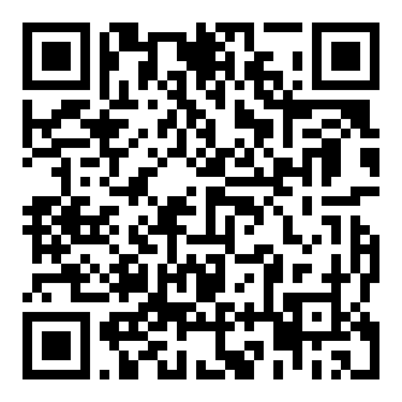

# Sexual Abuse Suspicion Score

A web-based clinical decision support tool that estimates the probability of sexual abuse based on clinical indicators.

## What Is This?

This application helps clinicians identify patients who may benefit from deeper exploration regarding potential sexual abuse. It analyzes patterns across seven clinical variables (depression, medications, violence exposure, etc.) to provide a probability estimate, not a diagnosis.

Key features:
- Works entirely in your browser (no data sent anywhere)
- Bilingual interface (French/English)
- Handles missing information
- Provides clear clinical recommendations
- Works on desktop and mobile

## Theory

### The Model

This tool uses a comprehensive multi-model system with **a separate [logistic regression](https://en.wikipedia.org/wiki/Logistic_regression) model for every possible combination of variables**.

When you enter information, the system automatically selects the exact model trained on that specific combination of variables. This ensures accurate probability estimates even when some information is missing.

We use seven clinical variables:
1. **Antidepressants** - Currently taking antidepressants
2. **Depression** - Diagnosis of depression
3. **Benzodiazepines** - Currently taking benzodiazepines
4. **Suicide attempt** - History of suicide attempt
5. **Violence** - Exposure to violence
6. **Gynecological disorders** - Documented gynecological issues
7. **Work disability duration** - Months of work disability

The expected prevalence of abuse in your population (default: 25%, adjustable based on your clinical context) are also taken into account as an additional input.

### How It Works

Probability calculation:

```
P(abuse) = 1 / (1 + exp(-z))
where: z = β₀ + β₁X₁ + β₂X₂ + ... + βₙXₙ
```

Performance (best model, all 7 variables):
- **[AUC](https://en.wikipedia.org/wiki/Receiver_operating_characteristic#Area_under_the_curve)**: 0.94 (excellent discrimination)
- **[Sensitivity](https://en.wikipedia.org/wiki/Sensitivity_and_specificity#Sensitivity)**: 84% (detects ~5 out of 6 cases)
- **[Specificity](https://en.wikipedia.org/wiki/Sensitivity_and_specificity#Specificity)**: 95% (very few false positives)

Interpretation thresholds:
- **< 30%**: Low suspicion → routine follow-up
- **30-70%**: Moderate suspicion → explore further
- **≥ 70%**: High suspicion → in-depth exploration recommended

Each prediction includes a **95% [confidence interval](https://en.wikipedia.org/wiki/Confidence_interval)** calculated using the **[delta method](https://en.wikipedia.org/wiki/Delta_method)**, accounting for prevalence adjustment and coefficient correlations. Quality warnings alert you when uncertainty is high.

## How to Run

### Online (Easiest)

Visit: **https://nestordemeure.github.io/abuse_checklist/**

Or scan this QR code:



### Local Server

If you prefer to run it locally:

```bash
python3 -m http.server 8000
```

Then open http://localhost:8000 in your browser.

## ⚠️ Important Disclaimer

**This tool is for research and educational purposes only. It is NOT intended for professional clinical use.**

- Based on limited research data (n=133 patients, 85% abuse cases)
- Has not been validated for clinical decision-making
- Should not replace clinical judgment or standard diagnostic procedures
- A low score does not exclude abuse
- A high score is not a diagnosis

**Always rely on comprehensive clinical assessment and professional judgment.**